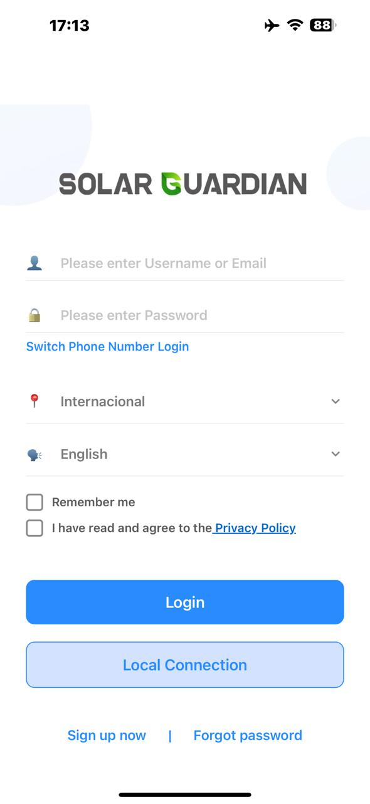
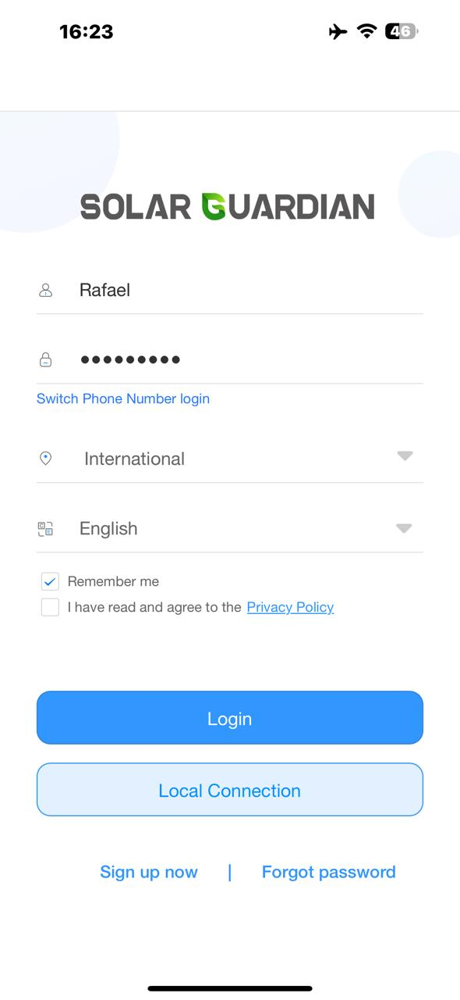

# 📱 Página de Clone do Aplicativo Solar Guardian

Este é um projeto de tela de login moderno desenvolvido em **React Native** utilizando o ecossistema **Expo**. O aplicativo conta com validações dinâmicas, seletores customizados e componentes nativos de formulário.

---

## 📸 Comparação Visual

Abaixo estão as imagens comparativas entre a página original que serviu de inspiração e o resultado desenvolvido neste projeto.

<div style="display: flex; flex-direction: row; gap: 10px;">
  
  
</div>

*À esquerda: Página Original (Referência) | À direita: Nova Página (Projeto Desenvolvido)*

---

## 👤 Desenvolvedor
* **Nome:** [Rafael Albino Ribeiro]
* **Turma/Disciplina:** [Turma 37 - React Native]

## 🛠️ Tecnologias Utilizadas
* **React Native** (com TypeScript)
* **Expo** (Ambiente de desenvolvimento)
* **Expo Checkbox** (Componente oficial para seleção independente)
* **React Native Element Dropdown** (Componente moderno de Select/Dropdown)

## 🚀 Funcionalidades da Tela
* Inputs estilizados com emojis alinhados perfeitamente à esquerda.
* Dropdowns customizados e independentes para seleção de país e idioma.
* Checkboxes nativos e independentes para as opções "Remember me" e "Privacy Policy".

---

## 🏃 Como Executar o Projeto

### 1. Pré-requisitos
Você precisa ter o **Node.js** instalado no seu computador e o aplicativo **Expo Go** instalado no seu celular (Android ou iOS).

### 2. Clonar ou Baixar o Projeto
Abra o seu terminal e navegue até a pasta do projeto (ou extraia o arquivo zip).

### 3. Instalar as Dependências
Instale todos os pacotes necessários rodando o comando:
```bash
npm install
npm install react-native-element-dropdown --save
npx expo install expo-checkbox
```

### 4. Iniciar o Servidor do Expo
Com as dependências instaladas, inicie o projeto rodando:
```bash
npx expo start
```

### 5. Visualizar o App
* **No Celular:** Abra a câmera do seu celular (ou o app Expo Go) e escaneie o **QR Code** que vai aparecer no terminal.
* **No Emulador:** Pressione a tecla `a` no terminal para abrir no emulador Android ou `i` para abrir no simulador iOS (caso tenha configurado).